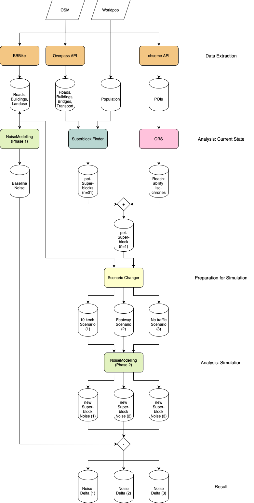
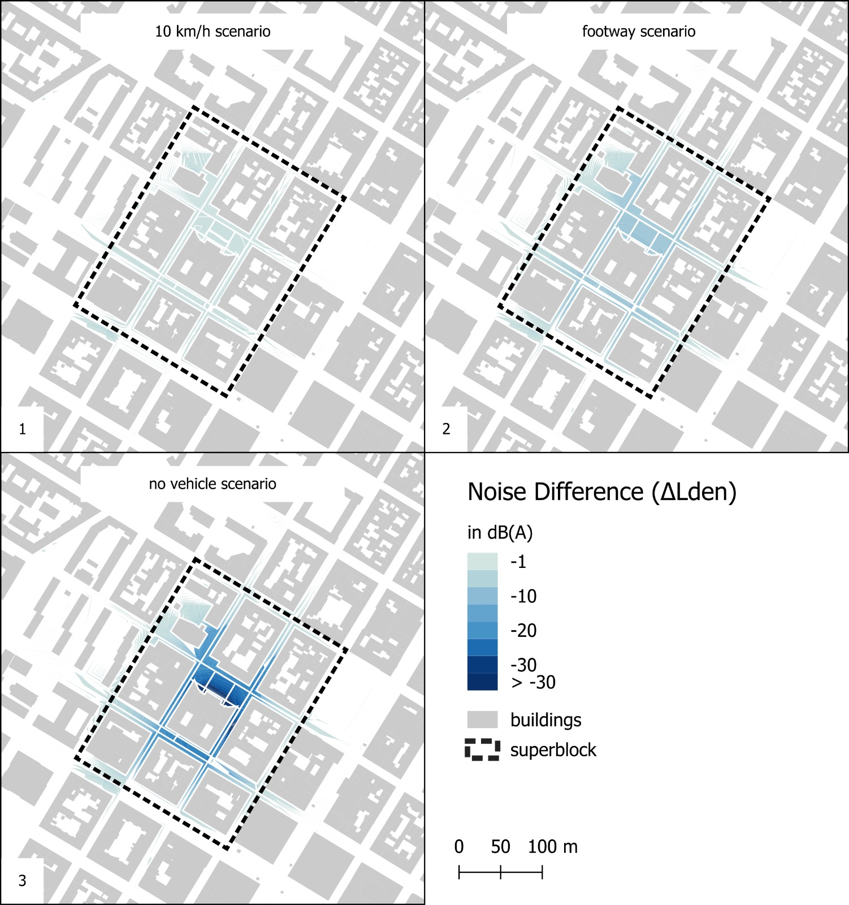

# NoiseModelling and Superblock Finder Analysis

This repository provides a detailed workflow for modeling traffic noise and accessibility in urban superblocks. Using open-source software and data, it evaluates noise propagation and POI accessibility, aimed at enhancing urban planning. 
Each step of the workflow is described in detail in dedicated folders (NM, ORS, SF) within this repository to facilitate reproduction.
Instructions for setting up the Python environment are provided [here](https://github.com/celthome/superblocks_mannheim/blob/main/conf/env.yml).

## Workflow

#### 1. Superblock Finder ([SF](https://github.com/celthome/superblocks_mannheim/tree/main/SF))
We implemented the SF locally to identify suitable building blocks based on network and spatial criteria (e.g., street loop length, density). 

#### 2. Superblock Accessibility Assessment ([using ORS](https://github.com/celthome/superblocks_mannheim/tree/main/ORS))
POI accessibility within superblocks was analyzed using the 5-Minute City (FMC) approach. POIs (categories: Food, Commercial, Health, Education, Recreation) were extracted from OSM using Overpass API, processed for accessibility with OpenRouteService (ORS), and filtered for superblock compliance.
 
In our study area, one superblock was identified that meets the FMC criteria.

#### 3. Noise Simulation for Superblocks ([NM](https://github.com/celthome/superblocks_mannheim/tree/main/NM))
We set up a local instance of NM following CNOSSOS-EU guidelines, which models sound propagation based on road type defaults. OpenStreetMap (OSM) data, sourced via BBBike.de, supports baseline noise level calculations. 
 
By adjusting the road classifications within the superblock and using NM, we simulated three noise scenarios, comparing changes in area-specific noise levels (ΔLden) against baseline metrics.

## Project Overview:

## Results 

#### Noise Simulation:

 

#### Noise level changes (ΔLden):

 

#### Data Sources and APIs 
- POI Data: OSM, extracted via Overpass API 
- Accessibility Isochrones: OpenRouteService (ORS)
- Noise Propagation: NoiseModelling (NM)
- Population Data: WorldPop

For further setup instructions, refer to the individual GitHub repositories and their respective documentation:

- NoiseModelling: https://github.com/Universite-Gustave-Eiffel/NoiseModelling
- OpenRouteService: https://github.com/GIScience/openrouteservice
- Superblock Finder: https://github.com/dymat/superblocks/tree/master

Note: Full methodological details will be added soon.
